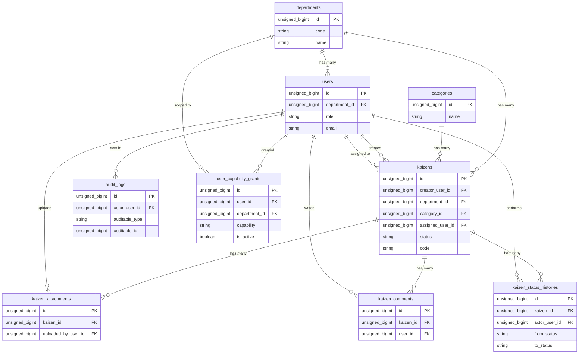

# KaizenFlow Veritabanı Tasarımı

## 1. Belgenin Amacı

Bu belge, KaizenFlow Sürekli İyileştirme Yönetim Sistemi'nin ilişkisel veritabanı (RDBMS) şemasını ve MySQL üzerindeki fiziksel veri modelini tanımlamak amacıyla hazırlanmıştır. Geliştirme ekibi bu tasarımı temel alarak Laravel migration, model, seeder sınıflarını ve Eloquent ilişkilerini oluşturacaktır. Henüz fiziksel migration kodları ve tablolar sistemde oluşturulmamış olup, bu belge referans kılavuz niteliğindedir.

## 2. Tasarım İlkeleri

Uygulama veri modeli tasarlanırken aşağıdaki ilkeler temel alınmıştır:

* **İlişkisel Bütünlük:** Tablolar arası tutarlılığın veritabanı seviyesinde korunması.
* **Veri Tekrarının Azaltılması:** Verinin normalize edilmesi ve gereksiz duplikasyonun önlenmesi (Normalization).
* **Foreign Key Kullanımı:** Silinen veya pasife alınan kayıtların yetim (orphan) veriler bırakmasını engelleyen kesin dış anahtar kısıtlamaları.
* **Denetlenebilirlik:** Tüm kritik değişikliklerin takip edilebileceği ve kimin yaptığı bilgisine ulaşılabilen audit tablolarının tasarlanması.
* **Geçmiş Kayıtlarının Korunması:** Değiştirilemez durum geçişleri geçmişiyle iş kurallarının ispatlanabilir yapıda tutulması.
* **Güvenli Dosya Metadata Yönetimi:** Veritabanında fiziksel dosya barındırmak yerine, dosyaların yalnızca hash ve metadata bilgileri ile yolunun güvenli şekilde tutulması.
* **Sorgu Performansı:** Okuma performansını artırmak amacıyla Foreign Key ve sık aranan alanlara verimli indeksleme yapılması.
* **Sentetik Geliştirme Verisi:** Modelin sahte veri üreteçleri (Factory) ile hızla ve güvenle doldurulabilecek yapıda tasarlanması.
* **MVP Kapsamına Uygunluk:** Fazla mühendislikten kaçınılması; uygulamanın MVP vizyonu (dört rol, sekiz durum) içerisinde gereksinim duyduğu en ideal alanların oluşturulması.
* **İş Kurallarının Birlikte Korunması:** Tüm veri kısıtlamalarının (unique, not null) veritabanı düzeyinde zorlanması, bu durumun uygulama içi doğrulama (Form Request) ile eşzamanlı olarak sağlanması.

Bu tasarımda MySQL veritabanı motoru kullanılacaktır ve tablo/alan isimlendirmeleri bütünüyle Laravel Eloquent standartlarına (`snake_case`, çoğul tablo isimleri vb.) uygun olacaktır.

## 3. Tablo Sınıflandırması

Veritabanı tabloları, iş gereksinimlerine ve uygulama altyapısına göre iki temel gruba ayrılmıştır.

### Alan/Domain Tabloları
* `departments`
* `users`
* `categories`
* `kaizens`
* `kaizen_attachments`
* `kaizen_comments`
* `kaizen_status_histories`
* `audit_logs`
* `user_capability_grants`

### Laravel Destek Tabloları
* `password_reset_tokens`
* `sessions`
* `notifications`
* `jobs`
* `job_batches`
* `failed_jobs`

Destek tabloları, Kaizen iş alanının temel veri modeli parçası değildir; uygulamanın session, bildirim ve asenkron kuyruk gibi teknik özelliklerini yönetir. Bu tablolar, ilgili Laravel özellikleri etkinleştirildikçe migration ile oluşturulacaktır.

Not: Sistemde dinamik bir `roles` veya `permissions` tablosu tasarlanmamıştır. MVP kapsamında sistemde yalnızca dört sabit rol (EMPLOYEE, OPEX_SPECIALIST, MANAGER, ADMIN) bulunacaktır.

## 4. Varlık İlişki Diyagramı

## 5. `departments` Tablosu

Sistemdeki departmanların ve organizasyon birimlerinin yönetildiği temel referans tablosudur.

* `id`: unsigned bigint primary key
* `code`: string (benzersiz ve zorunlu)
* `name`: string (benzersiz ve zorunlu)
* `is_active`: boolean (default true)
* `created_at`: timestamp
* `updated_at`: timestamp

**Kurallar:**
* Departman kayıtları, geçmiş Kaizen veya kullanıcı ilişkilerini bozmamak için fiziksel olarak silinmemelidir.
* Kullanım dışı veya kapanan bir departman, `is_active = false` yapılarak pasife alınmalıdır.
* `departments.manager_id` şeklinde bir alan oluşturulmamalıdır. Bir departmanın yöneticisi, `users` tablosunda `MANAGER` rolüne ve o `department_id` değerine sahip olan kullanıcı olarak tespit edilir. Bu yaklaşım, dairesel foreign key (circular foreign key) bağımlılığını önler ve veritabanı tutarlılığını artırır.

## 6. `users` Tablosu

Sistemdeki kullanıcıların hesap ve kimlik bilgilerini tutan ana tablodur.

* `id`: unsigned bigint primary key
* `department_id`: unsigned bigint (nullable)
* `name`: string
* `email`: string (benzersiz)
* `email_verified_at`: timestamp (nullable)
* `password`: string
* `role`: string
* `is_active`: boolean (default true)
* `remember_token`: string (nullable)
* `created_at`: timestamp
* `updated_at`: timestamp

**Kurallar:**
* `email` alanı mutlak şekilde benzersiz (unique) olmalıdır.
* `password` alanında parolalar asla düz metin (plain text) olarak tutulmamalı, Bcrypt gibi bir hash algoritması ile saklanmalıdır.
* `role` alanı sistemdeki dört kanonik rolden (EMPLOYEE, OPEX_SPECIALIST, MANAGER, ADMIN) yalnızca birini kabul etmelidir.
* Veritabanında ayrı bir dinamik rol/yetki tablosu oluşturulmamalı, rol verisi PHP uygulamasında Backed Enum ile temsil edilebilir ve veritabanında string/enum alanı olarak depolanabilir.
* `department_id` alanı, sistem yöneticisi (ADMIN) gibi departmansız hesaplar için boş (nullable) olabilir; ancak departmana bağımlı roller (MANAGER, EMPLOYEE) için uygulama tarafında zorunlu tutulmalıdır.
* Geçmiş Kaizenler veya audit loglarla ilişkileri korumak için kullanıcılar fiziksel olarak silinmemeli; ilişikleri kesilecekse `is_active = false` yapılarak pasifleştirilmelidir.
* Parola, reset token ve oturum bilgileri hiçbir şekilde audit kayıtlarına veya durum geçmişine aktarılmamalıdır.

## 7. `categories` Tablosu

Kaizen önerilerinin konusunu sınıflandırmak için (Örn: İş Güvenliği, Enerji Tasarrufu, Verimlilik) kullanılan referans tablosudur.

* `id`: unsigned bigint primary key
* `name`: string (benzersiz ve zorunlu)
* `description`: text (nullable)
* `is_active`: boolean (default true)
* `created_at`: timestamp
* `updated_at`: timestamp

**Kurallar:**
* Kategori adları sistemde benzersiz olmalıdır.
* Geçmiş Kaizen kayıtlarıyla ilişkisini yitirmemesi için, kullanım dışı kalan kategoriler silinmek yerine pasifleştirilmelidir (`is_active = false`).

## 8. `kaizens` Tablosu

Sistemin ana iş varlığıdır ve temel Kaizen kayıtlarını, durumlarını ve detaylarını barındırır.

* `id`: unsigned bigint primary key
* `code`: string (benzersiz, otomatik üretilen)
* `creator_user_id`: unsigned bigint (Kaizen sahibi)
* `department_id`: unsigned bigint (Kaizen kapsamı)
* `category_id`: unsigned bigint
* `assigned_user_id`: unsigned bigint (nullable)
* `title`: string
* `current_situation`: text
* `proposed_situation`: text
* `expected_benefit`: text
* `actual_result`: text (nullable)
* `realized_benefit`: text (nullable)
* `status`: string
* `target_date`: date (nullable)
* `submitted_at`: timestamp (nullable)
* `approved_at`: timestamp (nullable)
* `started_at`: timestamp (nullable)
* `completed_at`: timestamp (nullable)
* `rejected_at`: timestamp (nullable)
* `created_at`: timestamp
* `updated_at`: timestamp

**Kurallar:**
* `code` alanı benzersizdir, oluşturulduktan sonra değişmez ve sistem genelinde kullanıcıya gösterilen resmi Kaizen numarasıdır.
* `creator_user_id` kaydı oluşturan çalışanı (sahibini) temsil eder.
* `department_id` Kaizen'in organizasyon bazındaki kapsamını belirtir ve yöneticilerin yetki denetimlerinde kullanılır.
* `category_id` kaydın sınıflandırmasını temsil eder.
* `assigned_user_id` alanı başlangıçta `NULL` olup, kayıt onaylandığında (APPROVED) atanacak uygulama sorumlusunu tutar. Uygulama sorumlusu atanmış olmak, o kişiye durum geçişi yapma yetkisi vermez.
* Tüm metinsel açıklama (text) alanları veri kaybını önlemek için yeterli uzunluğa sahip olmalıdır.
* `status` alanı, yalnızca sistemde belirlenmiş sekiz kanonik değerden (`DRAFT`, `SUBMITTED`, `REVISION_REQUESTED`, `MANAGER_REVIEW`, `APPROVED`, `IN_PROGRESS`, `COMPLETED`, `REJECTED`) birini kabul etmeli ve uygulama tarafında PHP Backed Enum ile yönetilmelidir.
* `actual_result` ve `realized_benefit` alanları Kaizen ancak uygulamada tamamlanma aşamasına geldiğinde girilmeli, o zamana kadar `NULL` kalmalıdır.
* Hedef tarih (`target_date`) ve yaşam döngüsü tarihleri (`_at` ekli alanlar) geçişler gerçekleştiğinde doldurulmak üzere başlangıçta `NULL` olmalıdır.
* `COMPLETED` ve `REJECTED` durumları MVP kapsamında terminal durum olarak korunmalı ve değiştirilmemelidir.
* Kaizen kayıtları, denetlenebilirliğin sağlanması adına asla fiziksel olarak silinmemelidir.
* Ret veya revizyon isteklerinin gerekçeleri bu ana tabloda tutulmaz; tüm bu bağlam ve detaylar `kaizen_status_histories` tablosunda saklanır.
* Ana tablodaki `status` alanı, kaydın güncel durumuna hızlı erişimi sağlamak (okuma performansı) içindir ve detaylı durum geçmişi loglamasının yerine geçmez.

## 9. `kaizen_attachments` Tablosu

Kaizenlere eklenen belge, fotoğraf ve kanıt dosyalarının sadece üstverilerini (metadata) tutan tablodur.

* `id`: unsigned bigint primary key
* `kaizen_id`: unsigned bigint
* `uploaded_by_user_id`: unsigned bigint
* `original_name`: string
* `stored_name`: string
* `disk`: string
* `path`: string
* `mime_type`: string
* `size_bytes`: unsigned bigint
* `sha256`: string (nullable)
* `created_at`: timestamp

**Kurallar:**
* Veritabanının performansını düşürmemek adına dosya içerikleri (binary veriler) bu tabloda asla saklanmamalıdır. Veritabanında yalnızca dosya yolu ve güvenli metadata bilgileri tutulmalıdır.
* `original_name` (Kullanıcının bilgisayarındaki isim) doğrudan sunucuda dosya adı olarak kullanılmamalıdır; `stored_name` tahmin edilmesi zor, rastgele ve güvenli bir isim olarak üretilmelidir.
* Dosyalar dışarıdan doğrudan erişime açık public dizinlerde bulunmamalıdır; güvenli ve korumalı depolama yöntemleri kullanılmalıdır.
* Dosyaya dair MIME type, uzantı ve dosya boyutu (size_bytes) gibi bilgiler backend tarafından sıkı şekilde denetlenmeli ve kaydedilmelidir.
* İhtiyaç durumunda `sha256` alanı dosya bütünlüğü veya tekrar yükleme kontrolü için kullanılabilir.
* URL yolu sızdırılmış olsa bile dosyaya yalnızca yetkisi olan (kayıt sahibi veya onaycı) kullanıcı erişebilmelidir.
* Kaizen silinmediği için (fiziksel silme yasağı) bu eklerin de kontrolsüz şekilde (cascade delete) silinmemesine dikkat edilmelidir.

## 10. `kaizen_comments` Tablosu

Kaizenlerin değerlendirme süreçlerinde yetkililerin görüş ve not eklemesine olanak tanıyan tablodur.

* `id`: unsigned bigint primary key
* `kaizen_id`: unsigned bigint
* `user_id`: unsigned bigint
* `body`: text
* `created_at`: timestamp
* `updated_at`: timestamp

**Kurallar:**
* Yorumun sahibi (`user_id`) ve hangi kayda (`kaizen_id`) atıldığı ilişkisel olarak zorunludur.
* Yorum metni (`body`) veritabanında olduğu gibi saklansa da, okuma sırasında güvenli çıktı kaçışından (HTML Escape) geçirilerek XSS ataklarına karşı korunmalıdır.
* Bir yorum düzenlendiğinde `updated_at` güncellenmeli ve gerekli durumlarda audit loglarına yansıtılmalıdır.
* MVP kapsamında yorumların fiziksel olarak silinmesi özelliğinin kapatılması veya hiç sunulmaması denetim tutarlılığı açısından önerilmektedir.

## 11. `kaizen_status_histories` Tablosu

Her Kaizen için gerçekleşen değiştirilemez durum geçmişini ve iş akışı kayıtlarını muhafaza eden denetim tablosudur.

* `id`: unsigned bigint primary key
* `kaizen_id`: unsigned bigint
* `actor_user_id`: unsigned bigint
* `transition_code`: string
* `from_status`: string
* `to_status`: string
* `reason`: text (nullable)
* `metadata`: json (nullable)
* `created_at`: timestamp

**Kurallar:**
* `transition_code`, yalnızca kanonik olarak belirlenmiş dokuz geçiş kodunu (`TR-001` - `TR-009`) temsil etmelidir.
* `from_status` ve `to_status` alanları, yalnızca sekiz kanonik durumdan oluşmalıdır.
* Kaydın üzerinde gerçekleşen her başarılı durum değişikliğinde, kesinlikle bir geçmiş kaydı oluşturulmalıdır.
* Ana tablo olan `kaizens` üzerindeki durum güncellemesi ile bu tabloya yapılan kayıt işlemi mutlaka aynı veritabanı transaction bloğu içinde gerçekleştirilmelidir.
* Bu tablo yapısal olarak immutable (değiştirilemez) olmalıdır. Bu nedenle tablonun `updated_at` alanına ihtiyacı yoktur; kayıtlar asla güncellenmemeli veya silinmemelidir.
* Reddetme veya revizyon geçişlerindeki gerekçe (reason) zorunluluğu, bu alanda saklanmalı ve Service ile Form Request katmanlarında uygulama seviyesinde uygulanmalıdır.
* `metadata` alanı gerekiyorsa ek durum bilgileri için JSON formatında kullanılabilir; ancak parola, token, dosya içeriği veya gereksiz hassas kişisel veriler bu alana kesinlikle yazılmamalıdır.

## 12. `user_capability_grants` Tablosu

Sistem içindeki kullanıcı yetkinliklerini (capabilities) ve atanmış departman kapsamlarını departman düzeyinde granüler olarak tutan tablodur.

* `id`: unsigned bigint primary key
* `user_id`: unsigned bigint
* `department_id`: unsigned bigint
* `capability`: string
* `is_active`: boolean (default true)
* `created_at`: timestamp
* `updated_at`: timestamp

**Kurallar:**
* Bir kullanıcının aynı departmanda ve aynı yetenekte aktif olan tek bir kaydı olabilir (Unique constraint: `user_id, department_id, capability`).
* Uygulamaya özgü yetkilendirmelerde rollerden ziyade (örn: `OPEX_SPECIALIST`, `MANAGER`) bu yetkinlik atamalarına bakılır. (Örn: `KAIZEN_IMPLEMENTATION_ASSIGN`).
* İlgili departman silindiğinde veya pasife alındığında bu yetkiler devreden çıkar.

## 13. `audit_logs` Tablosu

Durum geçmişi iş akışı sürecini takip ederken, `audit_logs` tablosu genel sistem ve veri güvenliği açısından önemli teknik ve yönetsel eylemleri izler.

* `id`: unsigned bigint primary key
* `actor_user_id`: unsigned bigint (nullable)
* `event_type`: string
* `auditable_type`: string
* `auditable_id`: unsigned bigint
* `context`: json (nullable)
* `created_at`: timestamp

**Kurallar:**
* `actor_user_id`, sistem tarafından veya arka plan görevleriyle tetiklenen eylemler için `NULL` olabilir.
* `auditable_type` (Model sınıfı) ve `auditable_id`, olayın doğrudan ilişkili olduğu veri kaydını (polymorphic relation) gösterir.
* Olay bağlamı `context` içine JSON olarak eklenebilir; ancak bu bağlam yalnızca hassas olmayan bilgileri içermelidir.
* Log kayıtları değişmezdir; bu sebeple tablonun `updated_at` alanı bulunmamalı ve kayıtlar sonradan değiştirilip silinmemelidir.
* Parola, parola hash'i, oturum belirteçleri, token'lar, API anahtarları veya kişisel iletişim bilgileri kesinlikle audit log içeriklerine alınmamalıdır.
* IP adresi veya user-agent gibi veriler sadece yasal gereklilik veya açık güvenlik onayı varsa sınırlı miktarda tutulmalıdır.

## 13. Primary Key ve Foreign Key Kuralları

Tüm Foreign Key bağlantıları veri bütünlüğü için tablolarda şu şekilde yapılandırılacaktır:

| Kaynak | Hedef | Nullable | Önerilen Silme Davranışı | Gerekçe |
| :--- | :--- | :--- | :--- | :--- |
| `users.department_id` | `departments.id` | Evet | RESTRICT | Sistem yöneticisinin departmanı olmayabilir. Geçerli kullanıcıları olan bir departmanın yanlışlıkla silinmesini önler. |
| `kaizens.creator_user_id` | `users.id` | Hayır | RESTRICT | Kaizen sahibi olmadan var olamaz. İlgili kullanıcının silinmesini engeller. |
| `kaizens.department_id` | `departments.id` | Hayır | RESTRICT | Kaizenin yönetim kapsamını güvence altına alır. |
| `kaizens.category_id` | `categories.id` | Hayır | RESTRICT | İstatistik ve kategorizasyonu bozan yetim kayıt oluşumunu önler. |
| `kaizens.assigned_user_id` | `users.id` | Evet | RESTRICT | Atama henüz onay aşamasında yapılmadığı için nullable olmalıdır. |
| `kaizen_attachments.kaizen_id` | `kaizens.id` | Hayır | RESTRICT | Yetim dosyaların oluşmasını engeller. |
| `kaizen_attachments.uploaded_by_user_id` | `users.id` | Hayır | RESTRICT | Yükleme sorumlusunun kaybını engeller. |
| `kaizen_comments.kaizen_id` | `kaizens.id` | Hayır | RESTRICT | Yorumun ait olduğu kaydı güvence altına alır. |
| `kaizen_comments.user_id` | `users.id` | Hayır | RESTRICT | Yorum yazarının audit için korunmasını sağlar. |
| `kaizen_status_histories.kaizen_id` | `kaizens.id` | Hayır | RESTRICT | Geçmişin aidiyetini korur, Cascade delete önlenir. |
| `kaizen_status_histories.actor_user_id` | `users.id` | Hayır | RESTRICT | İşlemi yapanın teknik denetimi zorunludur. |
| `audit_logs.actor_user_id` | `users.id` | Evet | RESTRICT | Sistemsel bir işlem değilse tetikleyiciyi tutar. |
| `user_capability_grants.user_id` | `users.id` | Hayır | RESTRICT | Kullanıcı silinmez (is_active=false yapılır), yetim grant bırakmaz. |
| `user_capability_grants.department_id` | `departments.id` | Hayır | RESTRICT | Departman silinmez, fiziksel tutarlılık korunur. |

Veritabanı ilişkileri gereği kritik geçmiş ve audit kayıtlarında Cascade Delete (otomatik silme) kesinlikle kullanılmamalıdır. Bunun yerine ilgili kayıtlar fiziksel olarak silinmeyip pasifleştirme (`is_active` vb.) mantığıyla yönetilmelidir.

## 14. İndeks ve Benzersizlik Stratejisi

Veri tekrarını önlemek ve sorgu performansını desteklemek için şu indeks stratejileri uygulanacaktır:

**Benzersiz İndeksler (Unique):**
* `departments.code`
* `departments.name`
* `users.email`
* `categories.name`
* `kaizens.code`

**Foreign Key İndeksleri:**
Bütün Foreign Key alanları, Laravel standardı ve veri bütünlüğü performansı için indekslenmelidir.

**Kaizen Sorgu İndeksleri:**
Filtreleme ve sayfalama hızını artırmak amacıyla şu tekil alanlar indekslenmelidir:
* `status`
* `department_id`
* `creator_user_id`
* `assigned_user_id`
* `category_id`
* `target_date`
* `created_at`

**Önerilen Bileşik İndeksler (Composite):**
Sık kullanılan çoklu filtrelemeler için:
* `kaizens(status, department_id)`: Yöneticilerin sadece kendi departmanlarındaki onay bekleyen işleri görebilmesi.
* `kaizens(creator_user_id, created_at)`: Kullanıcının kendi kayıtlarını sıralaması.
* `kaizens(assigned_user_id, status)`: Sorumluların aktif işlerini listelemesi.
* `kaizen_status_histories(kaizen_id, created_at)`: Bir kaydın tarihçesinin sırayla getirilmesi.
* `audit_logs(auditable_type, auditable_id, created_at)`: Model spesifik logların sıralı okunması.

Not: Her olası alana indeks eklemek yazma (INSERT/UPDATE) maliyetini artırdığından, indeksler gerçek sorgular ve performans ölçümleri doğrultusunda periyodik olarak gözden geçirilmelidir.

## 15. Veri Bütünlüğü Kuralları

İş kurallarının veritabanında garanti altına alınması şu yöntemlerle sağlanacaktır:

* Tüm zorunlu alanlarda veritabanı seviyesinde `NOT NULL` kısıtlaması uygulanır.
* Birden çok tekrarı önlenmesi gereken alanlara (kod, e-posta, isim vb.) `UNIQUE CONSTRAINT` konulur.
* Tarihlerin ardışıklığı ve durum uyumları (Örn: Tamamlanma tarihi olmadan COMPLETED olunamaz) uygulama iş kuralları ile denetlenir.
* Boş başlık veya sadece boşluktan oluşan açıklamaların Form Request seviyesinde reddedilmesiyle sisteme değersiz veri akışı engellenir.
* Enum/string alanları uygulamanın desteklediği sadece izinli değerlerle (Örn: 8 kanonik durum) sınırlandırılır.
* Durum geçişleri hiçbir zaman Blade arayüzlerinden direkt yapılmaz, kesinlikle merkezi Service katmanından işlem görür.
* İşlemin ve tarihçesinin veritabanı Transaction bloğunda yapılmasıyla bütünlük korunur.
* Foreign Key kullanımı sayesinde ID olarak veritabanında bulunmayan kayıtlarla işlem engellenir.
* Geçmiş ve audit tabloları uygulama seviyesinde `updated_at` sütunu olmadan immutable olarak işaretlenir.
* Veritabanı kısıtları uygulamanın doğrulama (validation) süreçlerinin bir alternatifi değildir; uygulama katmanında geçerli veriler onaylandıktan sonra veritabanı için nihai güvenlik bariyeri görevi görürler.

## 16. Silme, Pasifleştirme ve Veri Saklama Yaklaşımı

Sistemde denetlenebilirlik büyük önem taşıdığından aşağıdaki strateji benimsenecektir:

* **Kullanıcılar:** Fiziksel olarak veritabanından silinmezler, ilişkilerin bozulmaması için pasifleştirilirler (`is_active = false`).
* **Departmanlar:** Fiziksel olarak silinmez, kullanım dışı kaldığında pasifleştirilirler.
* **Kategoriler:** Fiziksel olarak silinmez, pasifleştirilirler.
* **Kaizen Kayıtları:** MVP kapsamında kayıtlar fiziksel olarak silinmezler. Reddedilse bile saklanırlar.
* **Durum Geçmişi ve Audit:** Tablo yapısı gereği silinmez veya güncellenmezler.
* **Yorum ve Ekler:** İleride yer açmak adına arşivleme veya kontrollü silme özellikleri ayrıca değerlendirilebilir.
* Fiziksel bir dosya ve veritabanı metadata kaydının silinmesi, Transaction tek başına dosya sistemini kontrol edemeyeceği için hata oranını artırır ve dikkatle ayrılmış özel senaryolar gerektirir.
* Yasal veri saklama (Retention) politikaları ve KVKK/GDPR uyum kuralları asıl ortama çıkılmadan önce kurumsal birimlerce belirlenmelidir.

## 17. Örnek Veri Kullanım İlkeleri

Sistemin kurulumu, testi ve geliştirilmesi esnasında uyulması gereken veri ilkeleri:

* Sistemde hiçbir şekilde gerçek bir şirket adı, logosu, personel veya gerçek üretim ve finans verisi kullanılmamalıdır.
* Veritabanı tohumlaması (Seeder) ve otomatik testlerde sahte (Faker vb.) ve sentetik veriler üretilmelidir.
* Geliştirici veya çalışan adları yerine, tarafsız tanımlar (Örn: `John Doe`, `Ayşe Yılmaz` yerine `Test User`) tercih edilmelidir.
* Gerçek ve aktif e-posta adresleri, telefon numaraları veya kimlik verileri kullanılmamalıdır.
* Şifre ve kimlik bilgilerini barındıran `.env` gibi yapılandırma dosyaları asla Git deposunda (Repository) tutulmamalıdır.

## 18. Migration Uygulama Sırası

Foreign Key bağımlılıklarından ötürü, ileride geliştirilecek veritabanı Migration'ları aşağıdaki sırada çalıştırılacak şekilde yapılandırılmalıdır:

1. `departments` (Bağımsız referans)
2. `users` (Departments'a bağımlı)
3. `categories` (Bağımsız referans)
4. `kaizens` (Users, Departments, Categories tablolarına bağımlı)
5. `kaizen_attachments` (Kaizens ve Users tablolarına bağımlı)
6. `kaizen_comments` (Kaizens ve Users tablolarına bağımlı)
7. `kaizen_status_histories` (Kaizens ve Users tablolarına bağımlı)
8. `audit_logs` (Users tablosuna bağımlı)
9. Gerekli Laravel destek tabloları (Bağımsız veya özelliklere bağlı)

Bu sıralama, parent kayıtları hazır olmayan tabloların veritabanı constraint hatalarına sebep olmasını önleyecektir.

## 19. Gereksinim İzlenebilirliği

Aşağıdaki tablo, oluşturulan veri modelinin fonksiyonel ve teknik gereksinim gruplarını nasıl desteklediğini göstermektedir:

| Gereksinim Grubu / ID | Sağlanan Destek Yapısı |
| :--- | :--- |
| **FR-004, FR-005, FR-006** (Kullanıcı ve Rol Yönetimi) | `users` tablosu ve rol enum yapısı. |
| **FR-008, FR-009, FR-010** (Kaizen Oluşturma ve Düzenleme) | `kaizens` tablosu, taslak ve metin alanları. |
| **FR-007** (Departman ve Kategori Yönetimi) | `departments` ve `categories` referans tabloları. |
| **BR-003, BR-004** (Durum Geçişleri) | `kaizens.status` ve `kaizen_status_histories` tablosu. |
| **FR-015, FR-016** (Revizyon ve Ret Gerekçeleri) | `kaizen_status_histories.reason` alanı. |
| **FR-020** (Uygulama Sorumlusu Atama) | `kaizens.assigned_user_id` alanı. |
| **FR-013, FR-032** (Ek Dosyalar) | `kaizen_attachments` tablosu ve korumalı disk path alanı. |
| **FR-024** (Yorumlar) | `kaizen_comments` tablosu. |
| **FR-028** (Dashboard ve Raporlama) | `kaizens` ve `users` tabloları, `status` indeksleri. |
| **FR-025, FR-026, NFR-012** (Audit ve Geçmiş İzleme) | `kaizen_status_histories` ve `audit_logs` tabloları. |

## 20. Tasarım Kararları ve Gerekçeleri

| Karar | Gerekçesi |
| :--- | :--- |
| **Tek `users` tablosunda dört sabit rol** | Karmaşıklığı azaltır ve MVP kapsamındaki temel kullanıcı yönetimi ihtiyacını fazlasıyla karşılar. |
| **Ayrı dinamik rol tablosu bulunmaması** | Rol yapısının değişmezliğine olan güven ile uygulama katmanının temiz ve bakımı kolay tutulması. |
| **Yöneticinin `users.role` ve `department_id` ile belirlenmesi** | Dairesel foreign key problemlerini (Circular reference) önler. |
| **Kaizen ana tablosunda güncel durumun tutulması** | Durum bazlı listeleme sorgularında performans kaybı veya karmaşık JOIN işlemlerinin önüne geçer. |
| **Ayrı immutable durum geçmişi** | Değiştirilemez ve kanıtlanabilir iş akışı denetimi (Auditability) sunar. |
| **Durum geçmişi ile audit log'un ayrılması** | İş süreci (Workflow) ile teknik güvenlik olaylarının mantıksal olarak birbirinden izole edilmesi. |
| **Dosyanın değil metadata bilgisinin veritabanında tutulması** | Veritabanı boyutunun şişmesini engeller, performansı artırır. |
| **Kritik kayıtların fiziksel olarak silinmemesi** | Geçmişte yapılan işlemlerin tarihsel raporlarının bozulmaması (Orphan records engellemesi). |
| **Sentetik veri kullanımı** | Geliştirme/test esnasında gizliliği korumak ve güvenli bir geliştirme ortamı sağlamak. |
| **MySQL ve Laravel Eloquent uyumlu isimlendirme** | Framework'ün "Convention over Configuration" kurallarına tam uyum ile gereksiz model tanımlarından tasarruf etmek. |

## 21. Kapsam Dışı Unsurlar

Aşağıdaki veritabanı veya sistem özellikleri MVP aşaması kapsamında veri mimarisinin dışında tutulmuştur:

* Tablo tabanlı dinamik rol ve izin matrisi (RBAC veritabanı tabloları)
* Her tablo için çok kiracılı (Multi-tenant) kimlik alanları
* Harici şirket içi sistemler için (ERP vb.) dışa aktarım veya eşleştirme (mapping) tabloları
* Ek belgelerin veya kanıt resimlerinin doğrudan veritabanında `BLOB` / binary veri olarak saklanması
* Gelişmiş veri ambarı veya Big Data analiz kurguları için OLAP şeması
* Gerçek veri aktarımı ve otomatik veri anonimleştirme servis tabloları
* İşlemler için mikroservisler arasında gerçekleşecek olan dağıtık transaction (Saga pattern) mimarisi
* Gerçek şirket veya operasyon bilgisi kullanımı

## 22. Sonuç

Bu veritabanı tasarımı belgesi, KaizenFlow'un kararlı, ilişkisel ve denetlenebilir mimarisinin temelini oluşturmaktadır. Belgedeki tablolar, kurallar ve kısıtlar, ileride yürütülecek olan Laravel migration yazımı, Eloquent model ve relationship eşleştirmeleri, Form Request doğrulama ve veritabanı birim testleri (unit tests) için yegâne kanonik kaynak olarak görev alacaktır.
