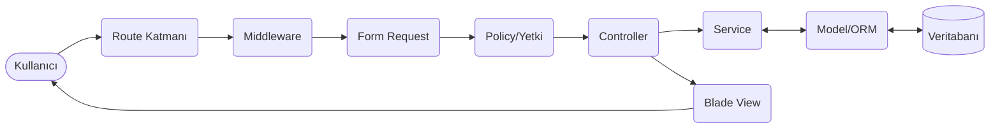
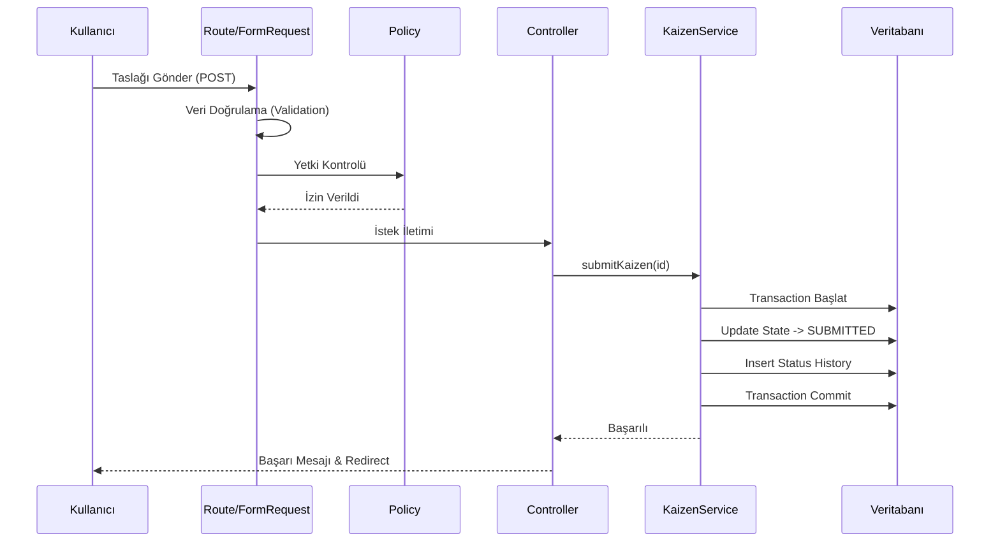

# KaizenFlow Sistem Mimarisi

## 1. Belgenin Amacı

Bu belge, KaizenFlow Sürekli İyileştirme Yönetim Sistemi'nin Laravel tabanlı teknik altyapısını, katmanlı mimarisini ve sistem bileşenleri arasındaki veri akışını tanımlamak amacıyla hazırlanmıştır. Geliştirme ekibi için ortak bir mimari vizyon sunmayı ve gereksinimlerin kod seviyesinde nasıl karşılanacağına rehberlik etmeyi amaçlar.

## 2. Mimari Hedefler

KaizenFlow MVP sürümünün tasarımı aşağıdaki temel mimari hedefler doğrultusunda şekillendirilmiştir:

* **Sürdürülebilirlik:** Katmanların (Controller, Service, Repository vb.) birbirinden izole edilmesiyle temiz ve yönetilebilir bir kod tabanı oluşturulması.
* **Güvenlik:** XSS, CSRF, IDOR gibi saldırı vektörlerine karşı koruma sağlanması ve veri erişim sınırlarının yetki politikalarıyla (Policy) güvence altına alınması.
* **Test Edilebilirlik:** İş kurallarının Service katmanına taşınmasıyla iş mantığının birim (Unit) ve özellik (Feature) testleriyle kolayca doğrulanabilir hale getirilmesi.
* **Sorumlulukların Ayrılması:** Controller sınıflarının ince tutularak (Thin Controller) tek sorumluluk (Single Responsibility) prensibine uyulması.
* **İş Akışı Kurallarının Merkezi Yönetimi:** Kaizen durum geçişlerinin dağınık yapıda değil, tek bir merkezi servis ve transaction blokları üzerinden yürütülmesi.
* **Denetlenebilirlik:** Tüm kritik işlemlerin ve durum geçişlerinin, kim tarafından ne zaman yapıldığını gösterecek şekilde değiştirilemez (immutable) audit loglarıyla kayıt altına alınması.
* **20 İş Günlük MVP Kapsamına Uygunluk:** Fazla mühendislikten (over-engineering) kaçınılarak, doğrudan hedefi çözen, kararlı bir monolit mimarinin hedeflenmesi.

## 3. Genel Sistem Mimarisi

Sistem, **Laravel tabanlı katmanlı monolit mimari** kullanılarak tasarlanmıştır. Bu yaklaşım, sistemin tüm bileşenlerinin (arayüz, iş mantığı, veritabanı erişimi) tek bir sunucu üzerinde uyum içinde çalışmasını sağlar.

Genel istek akışı şu şekildedir:
`Kullanıcı → Web Arayüzü → Route → Middleware → Form Request → Policy → Controller → Service → Model/Veritabanı → Blade View`



## 4. Mimari Katmanlar ve Sorumlulukları

Uygulamanın mantıksal organizasyonu aşağıdaki katmanlar aracılığıyla sağlanacaktır. Controller katmanı özellikle ince (thin) tutulacak, iş kuralları Service katmanında yürütülecektir.

| Katman | Temel Sorumluluk | Yapması Gerekenler | Yapmaması Gerekenler |
| :--- | :--- | :--- | :--- |
| **Blade View** | Kullanıcı arayüzü sunumu | Gelen veriyi formatlayarak HTML üretmek, yetkiye göre buton gizlemek. | Veritabanı sorgusu yapmak, karmaşık iş mantığı çalıştırmak. |
| **Route** | İstek yönlendirmesi | URL isteklerini uygun Controller metoduna yönlendirmek, ilgili Middleware'leri atamak. | Veri doğrulaması veya iş mantığı yürütmek. |
| **Middleware** | Küresel istek filtrelemesi | Oturum kontrolü, temel yetkilendirme ve istek loglaması yapmak. | Belirli bir modele özgü iş kuralı işletmek. |
| **Form Request** | Girdi doğrulaması | Formdan gelen verilerin veri tiplerini ve kurallarını (Validation) denetlemek. | Veritabanına kayıt yapmak, durum değiştirmek. |
| **Policy** | Model bazlı yetkilendirme | Kullanıcının ilgili kaydı görme, düzenleme veya işlem yapma hakkını denetlemek. | İşlem sonucunu değiştirmek veya veri kaydetmek. |
| **Controller** | İstek ve yanıt koordinasyonu | İsteği almak, yetkiyi (Policy) doğrulamak, Service'i çağırmak ve View/Redirect döndürmek. | **İş kuralı yazmak, veritabanı ile doğrudan karmaşık işlemler yapmak.** |
| **Service** | İş kuralları (Business Logic) | Durum geçişlerini doğrulamak, karmaşık veritabanı işlemlerini transaction içinde yürütmek. | HTTP Response döndürmek, doğrudan View çağırmak. |
| **Model** | Veri temsili | Eloquent ilişkilerini, accessor/mutator'ları ve kapsam (scope) tanımlarını barındırmak. | Form verisi doğrulamak veya harici API çağırmak. |
| **Database** | Veri depolaması | Tablolar arası ilişkileri ve Foreign Key kısıtlamalarını sağlamak. | Karmaşık iş mantığını Stored Procedure ile yürütmek. |
| **Notification** | Bildirim gönderimi | E-posta veya sistem içi bildirimleri kullanıcılara iletmek. | Ana iş akışını (Transaction) bloke etmek veya yavaşlatmak. |
| **Audit/History**| Denetim kaydı | Veri değişimlerini ve durum geçişlerini tarihsel olarak tutmak. | Silinmek veya sonradan değiştirilmek. |

## 5. Uygulama Modülleri

Sistem, bağımlılıkları kontrollü olarak tanımlanmış şu ana modüllerden oluşur:

* **Kimlik Doğrulama ve Kullanıcı Yönetimi:** Oturum yönetimi, kullanıcı hesabı oluşturma ve rol atama (ADMIN rolü tarafından) işlemlerini kapsar.
* **Organizasyon ve Departman Yönetimi:** Çalışanların organizasyon şemasındaki yerini ve Kaizenlerin ilgili departman yöneticilerine yönlendirilmesini sağlar.
* **Kaizen Yönetimi:** Temel form veri girişini, okumayı, güncellemeyi (taslak/düzeltme durumlarında) ve listelemeyi yönetir.
* **Onay ve Durum Geçişleri:** Sistemi oluşturan kanonik 8 durum ve 9 geçişi merkezi olarak işler; geçişlerin kurallara uygunluğunu denetler.
* **Ek Dosya Yönetimi:** Yüklenen kanıt belgelerini, format denetimleriyle beraber güvenli dosya sistemine yazar ve okur.
* **Yorum Yönetimi:** İlgili aşamalardaki Kaizenlere yetkili kişilerin görüş ve not eklemesini sağlar.
* **Bildirim Yönetimi:** Onaylanan, reddedilen veya düzeltme istenen işlemler sonrasında kullanıcıları haberdar eder.
* **Dashboard ve Raporlama:** Rol bazında (çalışan, uzman, yönetici) performans ve durum istatistiklerini özetler.
* **Durum Geçmişi ve Audit Log:** Tüm kritik eylemleri arka planda loglar ve durum tarihçesini muhafaza eder.

## 6. Örnek İstek Akışı

Aşağıdaki senaryo, bir çalışanın taslak (`DRAFT`) durumundaki Kaizen önerisini onaya (`SUBMITTED`) gönderdiği durumu açıklar.

1. Kullanıcı formu doldurur ve 'Gönder' butonuna tıklar.
2. Route katmanı POST isteğini karşılar ve ilgili Controller'a iletir.
3. Authentication Middleware kullanıcının oturumunun geçerli olduğunu doğrular.
4. Form Request sınıfı gerekli tüm zorunlu alanların (mevcut, önerilen, beklenen fayda) dolu ve geçerli olduğunu doğrular.
5. Policy katmanı, söz konusu Kaizen kaydının ilgili kullanıcıya ait olup olmadığını ve güncel durumun (DRAFT) bu işleme izin verip vermediğini denetler.
6. Controller, doğrulanmış veriyi alır ve ilgili Service katmanına işleme isteğini (`TR-001`) iletir.
7. Service katmanı, geçişin iş kurallarına uygunluğunu son kez doğrular.
8. Veritabanı transaction başlatılır.
9. Kaizen durumu `SUBMITTED` olarak güncellenir.
10. Durum geçmişi (History) tablosuna geçiş kaydı eklenir.
11. Gerekli sistem içi bildirim nesnesi hazırlanır.
12. İşlem sorunsuz tamamlanırsa transaction onaylanır (commit).
13. Controller, kullanıcıya işlemin başarılı olduğuna dair bir mesajla yönlendirme (Redirect) yapar.



## 7. Yetkilendirme Yaklaşımı

Sistemde kimlik doğrulama (Authentication - "Bu kim?") ile yetkilendirme (Authorization - "Bunu yapabilir mi?") ayrıştırılmıştır.
Kullanıcı oturumları Laravel Middleware üzerinden denetlenirken, veri erişimi ve işlem izinleri Laravel Policy'leri aracılığıyla yönetilir.

* **Rol Kontrolü Tek Başına Yetersizdir:** Sistemin güvenliği için sadece kullanıcının rolüne bakılamaz. İşlemin yapılabilmesi için; kayıt sahipliği, departman kapsamı, kaydın mevcut durumu ve geçiş yetkisi gibi faktörlerin birlikte değerlendirilmesi zorunludur.
* **ADMIN Rolü Sınırları:** ADMIN rolü sistem yönetimiyle görevlidir, otomatik iş akışı onay yetkisine sahip değildir.
* **Backend Kontrollerinin Zorunluluğu:** Kullanıcı arayüzünde butonların gizlenmesi sadece kullanıcı deneyimi (UX) içindir. Tüm güvenlik kontrolleri (Policy/Gate) backend tarafında istisnasız çalıştırılır.

## 8. Durum Geçişlerinin Yönetimi

Kaizen durum geçişleri (State Transitions) sistemin kalbidir. 
Sistemde tam olarak **8 kanonik durum** (`DRAFT`, `SUBMITTED`, `REVISION_REQUESTED`, `MANAGER_REVIEW`, `APPROVED`, `IN_PROGRESS`, `COMPLETED`, `REJECTED`) bulunmaktadır.

* **Merkezi Yönetim:** Geçişler doğrudan Controller veya Blade içinde değiştirilmez, yalnızca Service katmanı üzerinden çalıştırılır.
* **Dokuz Kanonik Geçiş:** Yalnızca `docs/kaizen-workflow.md` belgesinde tanımlanmış 9 geçiş yolu uygulanabilir. Yeni veya tanımsız geçiş yolları reddedilir.
* **Loglama ve Bütünlük:** Her geçişte aktör, tarih, eski durum, yeni durum, geçiş kodu ve varsa gerekçe kaydedilir. Bu işlem ve Kaizen kaydının güncellenmesi mutlaka **aynı transaction** içinde yürütülür.
* **Terminal Durumlar:** `COMPLETED` ve `REJECTED` aşamasına gelen kayıtlar sonlanır ve yeniden işleme açılamaz.

## 9. Veri Güvenliği ve Gizlilik

Sistem veri güvenliğini aşağıdaki standartlarla sağlar:

* Form verileri Form Request ile sunucu tarafında zorunlu olarak doğrulanır.
* Tüm veri giriş çıkışları CSRF korumasından geçer ve Blade şablonlarının otomatik "escape" özelliği ile XSS saldırılarına karşı korunur.
* SQL Injection riskine karşı veritabanı işlemleri bütünüyle Eloquent ORM ve Query Builder yapısı üzerinden yürütülür.
* Kullanıcı parolaları standart ve güçlü bir hash mekanizması (Bcrypt) ile şifrelenerek saklanır.
* Yüklenen kanıt dosyaları doğrudan ulaşıma açık public dizin yerine, korumalı depolamada (storage) saklanır. Dosyalar, yetki kontrollerinden sonra yazılımla sunulur. Yükleme sırasında dosya tipi (MIME) ve boyutu doğrulanır.
* Sistem ve denetim loglarında; parolalar, oturum kimlikleri veya gizli token değerleri kesinlikle tutulmaz.
* Test ve geliştirme süreçlerinde gerçek şirket bilgisi, personel isimleri veya gerçek operasyon verileri kullanılamaz; sadece sentetik veriler (Faker vb.) ile çalışılır.
* Gizli anahtar ve yapılandırmaları barındıran `.env` dosyası Git repository'sine eklenmez.

## 10. Transaction ve Hata Yönetimi

Veri bütünlüğünü sağlamak için birden fazla tabloyu ilgilendiren durum geçişleri ve kayıt işlemleri veritabanı transaction blokları içinde yürütülür.
Bir işlem sırasında hata oluşursa (örneğin ana kayıt güncellenip history yazılamazsa) tüm işlemler geri alınır (rollback).

Son kullanıcıya "Bilinmeyen veritabanı hatası" gibi ayrıntılı ve teknik sistem hataları gösterilmez, bunun yerine güvenli ve açıklayıcı standart uyarılar verilir. Beklenmeyen hataların tüm teknik detayı, güvenli sunucu uygulama loglarında depolanır.

## 11. Bildirim Yaklaşımı

MVP kapsamında bildirimler Laravel Notification alt yapısı kullanılarak tasarlanacaktır. 
E-posta veya veritabanı bazlı sistem içi bildirimlerin gönderimi işlemi, ana iş akışı transaction'larını bloke etmemesi ve sistemi yavaşlatmaması için uygun yapıda kodlanacak, ilerleyen süreçte asenkron kuyruk (Queue) mimarisine geçirilebilecek şekilde izole edilecektir.

## 12. Test Edilebilirlik

Proje kodunun doğruluğu ve süreçlerin kararlılığı çok katmanlı testlerle güvence altına alınacaktır:

* **Unit Test:** Service katmanındaki iş kurallarını ve Model kapsamındaki özellikleri yalıtılmış olarak doğrular.
* **Feature Test:** Uygulama modüllerini, HTTP istek/yanıt döngüsünü ve uçtan uca veri akışını doğrular.
* **Policy/Yetki Testleri:** Yanlış rollerin kritik alanlara erişiminin engellendiğini doğrular.
* **Durum Geçişi Testleri:** Belirlenen 9 geçiş haricindeki yasadışı geçiş denemelerinin engellendiğini doğrular.
* **Validation Testleri:** Hatalı form girişlerinin Form Request aşamasında reddedildiğini kontrol eder.
* **Transaction Senaryoları:** Hata durumunda (rollback) kısmi veri yazımının olmadığını kanıtlar.

## 13. Planlanan Klasör Yapısı

Sistem mimarisi için hedeflenen Laravel klasör organizasyonu aşağıdaki gibidir. (Not: Bu yapı henüz proje üzerinde fiziksel olarak oluşturulmamış olup, sadece rehber amaçlıdır.)

```text
app/
├── Http/
│   ├── Controllers/    # HTTP İstek yönetim ve yanıt sınıfları
│   └── Requests/       # Form doğrulama sınıfları
├── Policies/           # Rol ve sahiplik denetim sınıfları
├── Services/           # Merkezi iş mantığı ve geçiş servisleri
├── Models/             # Veritabanı modelleri
└── Notifications/      # Sistem içi ve e-posta bildirim sınıfları
resources/
└── views/              # Blade arayüz şablonları
routes/                 # Web ve API yönlendirmeleri
database/
├── migrations/         # Veritabanı şema kurulumları
└── seeders/            # Sentetik demo verisi üreticileri
tests/
├── Unit/               # Birim testler
└── Feature/            # Entegrasyon ve özellik testleri
```

## 14. Mimari Kararlar

| Mimari Karar | Gerekçesi |
| :--- | :--- |
| **Laravel Tabanlı Katmanlı Monolit** | MVP için en hızlı, kararlı ve bakım yapılabilir geliştirme modelini sağlar. |
| **Blade Tabanlı Sunucu Tarafı Arayüz** | Harici SPA (React/Vue) gereksinimini ortadan kaldırarak mimari karmaşıklığı azaltır. |
| **Merkezi Service Katmanı** | İş mantığının HTTP katmanından (Controller) ayrılarak tekrar kullanılabilir ve test edilebilir olmasını sağlar. |
| **Policy Tabanlı Kayıt Yetkilendirmesi** | İzinlerin her yere dağılması yerine nesne odaklı merkezi bir denetim noktasına alınmasını sağlar. |
| **Form Request Tabanlı Doğrulama** | Doğrulama kurallarını Controller dışına taşıyarak kod okunabilirliğini artırır. |
| **MySQL İlişkisel Veritabanı** | Kurumsal verilerin bütünlüğü, ilişkileri ve transaction yönetimi için idealdir. |
| **Transaction Tabanlı Durum Geçişleri** | Hata anında veri tutarsızlığını, kısmi kayıt oluşmasını kesin olarak engeller. |
| **Immutable Durum Geçmişi ve Audit Kayıtları** | Kurumsal denetlenebilirliği garanti altına alır. |
| **Korumalı Dosya Depolama** | Yetkisiz kişilerin şirket dokümanlarına URL üzerinden erişimini engeller. |
| **Sentetik Geliştirme ve Test Verisi** | Gizlilik ihlali riskini, test ve canlı veri karışıklığını tamamen önler. |

## 15. Kapsam Dışı Mimari Unsurlar

Minimum Uygulanabilir Ürün (MVP) kapsamını korumak için aşağıdaki unsurlar mimarinin dışındadır:

* Mikroservis mimarisi veya dağıtık sistemler
* Özel Native/Hybrid mobil uygulama geliştirilmesi
* Gerçek zamanlı WebSocket altyapısı (Live push notifications)
* Harici kurumsal sistem (LDAP, Active Directory, SAP, ERP vb.) entegrasyonu
* Gelişmiş makine öğrenmesi veya yapay zeka analizleri
* Gerçek şirket, üretim veya kişisel verilerin kullanımı
* Dinamik rol ve izin (RBAC) tasarım ekranı

## 16. Sonuç

Bu sistem mimarisi belgesi; projenin güvenlik, test edilebilirlik ve sürdürülebilirlik beklentilerini dengeleyen bir çerçeve sunar. Bir sonraki aşamada hazırlanacak olan veritabanı tasarımı (database-design.md), Laravel uygulamasının fiziksel kurulumu ve modül geliştirme çalışmaları, bu belgedeki karar ve sınırlara bağlı kalınarak yürütülecektir.
