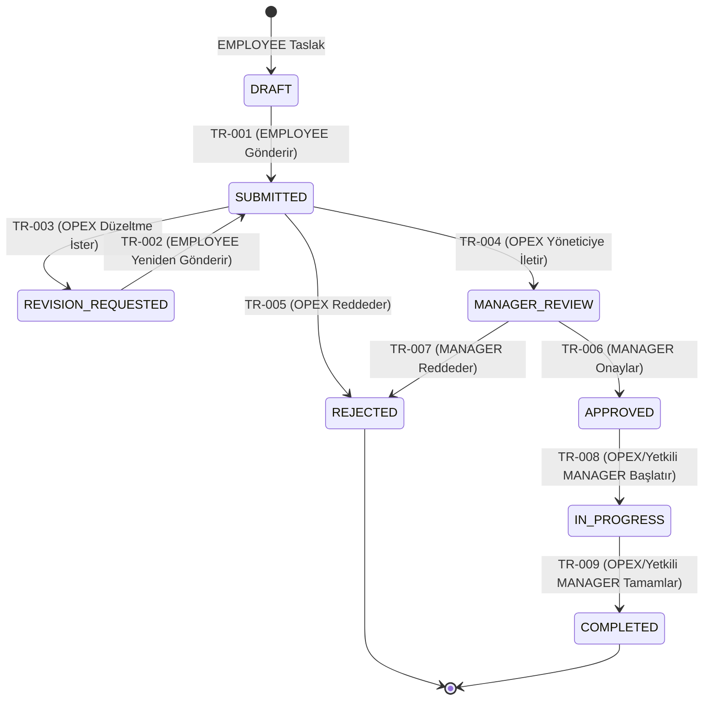

# KaizenFlow – Kaizen İş Akışı ve Durum Geçişleri

* **Belge sürümü:** 1.0
* **Staj günü:** Gün 2
* **Çalışma tarihi:** 12.08.2026
* **Durum:** MVP iş akışı temeli
* **İlgili Issue:** #7
* **Parent Epic:** #3
* **İlgili gereksinim belgesi:** `docs/requirements.md`

## 1. Belgenin Amacı
Bu belge, KaizenFlow sistemindeki durum (state) geçiş kurallarını, yetkilendirmeleri ve reddetme/düzeltme yollarını merkezi olarak tanımlar. Bu doküman, uygulama geliştirme (Laravel backend policy ve transition servisleri) aşamasına mimari yönlendirme yapacak ve otomatik geçiş testlerinin (unit/feature) yazılmasında temel senaryo referansı olarak kullanılacaktır.

## 2. İş Akışı İlkeleri
* **Sabit iş akışı:** Sistemde durumlar arası geçiş yolları statik olarak tanımlanmıştır. Beklenmeyen bir geçiş talep edilemez.
* **Merkezi transition service kullanımı:** Tüm durum geçişleri tek bir backend servisi üzerinden kontrollü olarak yapılır.
* **Backend policy ve sahiplik kontrolü:** Yetkilendirme kararları yalnızca kullanıcı arayüzü butonlarının gizlenmesiyle değil, mutlaka backend tarafında rol ve kayıt sahipliği kontrolleriyle uygulanır.
* **Her geçişin transaction içinde yürütülmesi:** Durum değişikliği, veritabanı tutarlılığını sağlamak için veritabanı transaction blokları içinde yürütülür.
* **Geçiş öncesinde güncel durumun yeniden doğrulanması:** İşlem esnasında kaydın veritabanındaki güncel durumu kontrol edilerek eşzamanlı çakışmalar önlenir.
* **Başarılı geçişle durum geçmişinin aynı transaction içinde kaydedilmesi:** Durum başarıyla değiştiği anda log veya geçmiş tablosuna yazım işlemi aynı transaction'da tamamlanır.
* **Başarısız geçişte kısmi kayıt bırakılmaması:** Transaction kuralı gereği hata anında hiçbir veri değiştirilmez.
* **Arayüz kontrolünün tek başına güvenlik sağlamaması:** Frontend manipülasyonlarına karşı tam bir API/Backend doğrulaması esastır.
* **Tekrarlanan isteğin ikinci bir geçiş veya geçmiş kaydı üretmemesi:** Aynı geçiş aynı durumda tekrar talep edilirse idempotent davranılarak fazladan log üretimi engellenir veya işlem reddedilir.

## 3. Roller ve İş Akışı Sorumlulukları
| Rol | Sorumlulukları | Yasaklı İşlemler |
| :--- | :--- | :--- |
| **EMPLOYEE** | Kendi Kaizen taslaklarını oluşturmak, düzenlemek ve onaya göndermek (veya düzeltilip yeniden göndermek). | Başkasına ait kayıtları göremez, onaylayamaz, reddedemez. |
| **OPEX_SPECIALIST** | Gönderilen Kaizenleri incelemek, eksiklikleri belirtip düzeltme istemek, reddetmek veya uygunsa yönetici incelemesine iletmek. Uygulama takibi yapmak. | Kaizen onayını tek başına veremez, yönetici veya sistem tanımlarını yapamaz. |
| **MANAGER** | Kendi yetki kapsamındaki önerileri değerlendirip nihai onayı vermek veya gerekçeli reddetmek. Uygulama aşamasını başlatıp kapatmak. | Kapsamı dışındaki veya OPEX onayından geçmemiş kayıtları onaylayamaz. |
| **ADMIN** | Kullanıcı hesapları, roller, departmanlar ve sistem ayarlarını yönetmek. | İş akışına müdahale edemez, bir Kaizen önerisini tek başına onaylayamaz veya reddedemez. |

## 4. Durum Sözlüğü
| Durum | Türkçe Karşılığı | Açıklama | Kaydı Düzenleyebilen Rol | İzin Verilen Sonraki Durumlar | Terminal Durum Mu |
| :--- | :--- | :--- | :--- | :--- | :--- |
| **DRAFT** | Taslak | Çalışanın öneri girmeye başladığı ancak henüz onaya göndermediği kayıt. | EMPLOYEE | SUBMITTED | Hayır |
| **SUBMITTED** | Gönderildi (OPEX İncelemesi) | Çalışan tarafından gönderilmiş ve OPEX kuyruğuna düşmüş öneri. | (Düzenlenemez) | REVISION_REQUESTED, MANAGER_REVIEW, REJECTED | Hayır |
| **REVISION_REQUESTED** | Düzeltme Bekleniyor | OPEX tarafından incelenip eksik görüldüğü için çalışandan düzeltme istenmiş kayıt. | EMPLOYEE | SUBMITTED | Hayır |
| **MANAGER_REVIEW** | Yönetici İncelemesi | OPEX onayından geçmiş ve sorumlu yöneticinin kararını bekleyen öneri. | (Düzenlenemez) | APPROVED, REJECTED | Hayır |
| **APPROVED** | Onaylandı | Yönetici tarafından uygulanmasına karar verilmiş ve uygulama sorumlusu/hedefi atanmış öneri. | (Düzenlenemez) | IN_PROGRESS | Hayır |
| **IN_PROGRESS** | Uygulamada | İyileştirme faaliyetlerine başlanmış olan öneri. | (Düzenlenemez) | COMPLETED | Hayır |
| **COMPLETED** | Tamamlandı | Uygulaması bitmiş, sonuç ve sağlanan fayda değerleri girilerek başarıyla kapatılmış öneri. | (Düzenlenemez) | - | **Evet** |
| **REJECTED** | Reddedildi | OPEX veya Yönetici tarafından uygun bulunmayarak gerekçeli olarak reddedilmiş öneri. | (Düzenlenemez) | - | **Evet** |

## 5. Ana Süreç Diyagramı

## 6. Durum Geçiş Matrisi

| Geçiş ID | Kaynak Durum | İşlem | Hedef Durum | Yetkili Rol | Ön Koşullar | Zorunlu Girdiler | Başarılı İşlem Sonrası Kayıtlar | Hata Durumu |
| :--- | :--- | :--- | :--- | :--- | :--- | :--- | :--- | :--- |
| TR-001 | DRAFT | Öneriyi gönder | SUBMITTED | EMPLOYEE | Kayıt çalışana ait olmalı. | Zorunlu Kaizen alanları dolu olmalı. | Durum geçmişine log atılır. | Alan eksikse 422, yetki yoksa 403. |
| TR-002 | REVISION_REQUESTED | Düzeltilen öneriyi yeniden gönder | SUBMITTED | EMPLOYEE | Kayıt çalışana ait olmalı. | Zorunlu Kaizen alanları düzeltilmiş olmalı. | Durum geçmişine log atılır. | Yetki yoksa 403. |
| TR-003 | SUBMITTED | Düzeltme iste | REVISION_REQUESTED | OPEX_SPECIALIST | Sistemde OPEX yetkisi olmalı. | Düzeltme gerekçesi zorunludur. | Durum geçmişine gerekçeyle birlikte yazılır. | Gerekçe yoksa 422. |
| TR-004 | SUBMITTED | Yönetici değerlendirmesine ilet | MANAGER_REVIEW | OPEX_SPECIALIST | Sistemde OPEX yetkisi olmalı. | OPEX değerlendirme notu bulunmalıdır. | Durum geçmişine log atılır. | Not yoksa 422. |
| TR-005 | SUBMITTED | Gerekçeli reddet | REJECTED | OPEX_SPECIALIST | Sistemde OPEX yetkisi olmalı. | Ret gerekçesi zorunludur. | Durum geçmişine ret gerekçesi yazılır. | Gerekçe yoksa 422. |
| TR-006 | MANAGER_REVIEW | Onayla | APPROVED | MANAGER | Kayıt yöneticinin yetki alanında olmalı. | Uygulama sorumlusu ve hedef tarih zorunludur. | Uygulama sorumlusu ve hedef tarih kaydedilir, durum geçmişine log atılır. | Yetkisiz erişim 403. |
| TR-007 | MANAGER_REVIEW | Gerekçeli reddet | REJECTED | MANAGER | Kayıt yöneticinin yetki alanında olmalı. | Ret gerekçesi zorunludur. | Durum geçmişine ret gerekçesi yazılır. | Gerekçe yoksa 422. |
| TR-008 | APPROVED | Uygulamayı başlat | IN_PROGRESS | OPEX_SPECIALIST veya yetkili MANAGER | Uygulama sorumlusu atanmış ve hedef tarih belirlenmiş olmalı. | - | Durum geçmişine log atılır. | Sorumlu atanmamışsa işlem engellenir. |
| TR-009 | IN_PROGRESS | Sonuçları kaydet ve tamamla | COMPLETED | OPEX_SPECIALIST veya yetkili MANAGER | - | Sonuç açıklaması ve gerçekleşen fayda zorunludur. | Terminal duruma alınır ve geçmiş güncellenir. | Girdi eksikse 422. |

## 7. Temel Başarılı Akış
1. **DRAFT → SUBMITTED:** Aktör: EMPLOYEE. İşlem: Kaydet ve Gönder. Sistem: Zorunlu alan doğrulaması yapar. Oluşan durum: SUBMITTED. Audit/History: Geçiş history'e loglanır.
2. **SUBMITTED → MANAGER_REVIEW:** Aktör: OPEX_SPECIALIST. İşlem: Yöneticiye ilet. Sistem: OPEX yetkisi doğrular. Oluşan durum: MANAGER_REVIEW. Audit/History: Geçiş history'e loglanır.
3. **MANAGER_REVIEW → APPROVED:** Aktör: MANAGER. İşlem: Onayla. Sistem: Yönetici yetkisi ve sorumluluk kapsamı doğrulaması. Oluşan durum: APPROVED. Audit/History: Geçiş history'e loglanır.
4. **APPROVED → IN_PROGRESS:** Aktör: OPEX_SPECIALIST veya yetkili MANAGER. İşlem: Başlat. Sistem: Sorumlu ataması kontrolü. Oluşan durum: IN_PROGRESS. Audit/History: Geçiş history'e loglanır.
5. **IN_PROGRESS → COMPLETED:** Aktör: OPEX_SPECIALIST veya yetkili MANAGER. İşlem: Tamamla. Sistem: Sonuç verisi kontrolü. Oluşan durum: COMPLETED. Audit/History: Geçiş history'e loglanır.

## 8. Düzeltme ve Yeniden Gönderme Akışı
**Yol:** SUBMITTED → REVISION_REQUESTED → SUBMITTED

* **Düzeltme İsteği:** OPEX uzmanı, düzeltme gerekçesi boş olmayacak şekilde işlemi tetikler. Sistem durumu REVISION_REQUESTED yapar. Önceki değerlendirme ve geçmiş kayıtları silinemez.
* **Düzenleme İzni:** Yalnızca kayıt sahibi (EMPLOYEE) bu durumda kaydı tekrar açıp düzenleme hakkına sahiptir.
* **Yeniden Gönderme:** Çalışan düzenlemeyi bitirip formu yeniden gönderdiğinde durum tekrar SUBMITTED konumuna geçer ve yeni bir history kaydı oluşturur.
* **Döngü:** OPEX gerekirse birden fazla kez düzeltme isteyebilir. MANAGER_REVIEW aşamasında MVP kapsamında düzeltme talebi yoktur; yönetici onaylar veya gerekçeli reddeder.

## 9. Ret Akışları

### OPEX_SPECIALIST Ret Akışı
* OPEX, SUBMITTED durumundaki bir kaydı gerekçeli olarak reddedebilir.
* Ret gerekçesi zorunludur.
* Durum REJECTED olur, geçmiş kaydı ve audit üretilir.

### MANAGER Ret Akışı
* MANAGER, MANAGER_REVIEW aşamasındaki öneriyi gerekçeli reddedebilir.
* Ret gerekçesi zorunludur.
* Durum REJECTED olur, geçmiş kaydı ve audit üretilir.

**Genel Kurallar:**
* REJECTED terminal durumdur.
* Reddedilen kayıt çalışan tarafından düzenlenemez veya yeniden gönderilemez.
* Yeniden açma ancak gelecekte ayrı gereksinim ve Issue ile eklenebilir.

## 10. Uygulama ve Tamamlama Akışı
**Yol:** APPROVED → IN_PROGRESS → COMPLETED

Uygulama sorumlusu operasyonel çalışmayı yürütür; bu atama tek başına durum geçiş yetkisi sağlamaz. APPROVED → IN_PROGRESS ve IN_PROGRESS → COMPLETED geçişlerini yalnızca OPEX_SPECIALIST veya yetkili MANAGER gerçekleştirir.

* **Başlangıç:** Onaylanan kayıt, uygulama sorumlusu ve hedef tarih belirlendikten sonra başlatma işlemi tetiklenir. Yetkili rol kontrolü sağlanır.
* **Sonuçlandırma:** İşlem tamamlanırken zorunlu olarak "Sonuç Açıklaması", "Tahmini Fayda" ve "Gerçekleşen Fayda", "Fayda Türü ve Birimi" alanları istenir.
* **Geçiş:** Bilgiler doğrulandıktan sonra sistem durumu COMPLETED yapar. Tamamlama sonrasında temel alanların ve sonucun değiştirilememesi güvence altına alınır.

## 11. Yetki Matrisi

| İşlem | EMPLOYEE | OPEX_SPECIALIST | MANAGER | ADMIN |
| :--- | :--- | :--- | :--- | :--- |
| Taslak oluşturma | İzinli | Yasak | Yasak | Yasak |
| Kendi taslağını düzenleme | İzinli | Yasak | Yasak | Yasak |
| Gönderme | İzinli | Yasak | Yasak | Yasak |
| Yeniden gönderme | İzinli | Yasak | Yasak | Yasak |
| OPEX kuyruğunu görüntüleme | Yasak | İzinli | Yasak | Yasak |
| Düzeltme isteme | Yasak | İzinli | Yasak | Yasak |
| Yöneticiye iletme | Yasak | İzinli | Yasak | Yasak |
| OPEX reddi | Yasak | İzinli | Yasak | Yasak |
| Yönetici onayı | Yasak | Yasak | Kapsama bağlı | Yasak |
| Yönetici reddi | Yasak | Yasak | Kapsama bağlı | Yasak |
| Uygulamayı başlatma | Yasak | İzinli | Kapsama bağlı | Yasak |
| Kaizen’i tamamlama | Yasak | İzinli | Kapsama bağlı | Yasak |
| Kullanıcı yönetimi | Yasak | Yasak | Yasak | İzinli |
| Sistem tanımlarını yönetme | Yasak | Yasak | Yasak | İzinli |

## 12. Kayıt Sahipliği ve Görünürlük
* **EMPLOYEE:** Yalnızca kendi Kaizen kayıtlarını görüntüleyebilir. URL'deki ID değiştirilerek erişim denendiğinde backend policy erişimi engeller. IDOR riskine karşı koruma backend seviyesinde çözülür.
* **OPEX_SPECIALIST:** SUBMITTED ve sonrasındaki aşamalara sahip olan tüm kayıtları görebilir.
* **MANAGER:** Yalnızca MANAGER_REVIEW sonrası aşamalarda olup kendi birimine atanmış kayıtları görebilir.
* **Dosya Ekleri:** Dosya ekleri public olarak sunulmaz. Dosyaların indirilmesi sürecinde de aynı sahiplik ve rol kontrolünden geçmesi backend tarafında güvence altına alınır.

## 13. Durum Geçişi Güvenliği
* **Form Request validation:** Geçişlerdeki zorunlu alan doğrulamaları Request katmanında yapılır.
* **Policy/Gate:** Transition fonksiyonunu tetikleme yetkisi Policy sınıflarıyla kesinleştirilir.
* **Merkezi transition service:** Tüm geçiş işlemleri kapsüllenmiş bir service katmanında gerçekleştirilir.
* **Veritabanı transaction:** History yazımı ve state güncellemeleri transaction ile korunur.
* **Güncel durum doğrulaması:** Eşzamanlı isteklerde çift işlem önleme amacıyla güncel durum lock veya yeniden doğrulama ile kontrol edilir.
* **Hatalar:** Yetkisiz geçişte 403, geçersiz durum geçişinde 422; kayıt bulunamadığında veya görünür olmadığında bilgi sızıntısını önleyen 404 yaklaşımı uygulanır.
* **Hassas Bilgi Sızıntısı:** Hata mesajlarında hassas veritabanı veya stack trace ayrıntısı bulunmamalıdır.

## 14. Durum Geçmişi ve Audit Kaydı
**Durum Geçmişi:**
* Kaizen kimliği
* Önceki durum
* Yeni durum
* İşlemi yapan kullanıcı
* İşlem zamanı
* Gerekçe veya açıklama
* Geçiş ID’si

**Audit Kaydı:**
* Olay türü
* Aktör
* Hedef kayıt
* Zaman
* Sonuç
* Güvenli metadata
* Not: Parola, session değeri, token veya dosya içeriği kesinlikle loglanmayacaktır.

## 15. Geçersiz İşlem Örnekleri

| Geçersiz Senaryo | Beklenen Sistem Davranışı |
| :--- | :--- |
| Başkasının taslağını gönderme | İşlem reddedilir (404/403 döndürülür) |
| SUBMITTED kaydı çalışan tarafından düzenleme | Düzenleme kaydedilmez (403 döndürülür) |
| Gerekçesiz düzeltme talebi | Validation hatası (422) ile işlem iptal edilir |
| OPEX rolünün yönetici onayı vermesi | Yetkisiz işlem (403), durum geçişi yapılmaz |
| MANAGER rolünün OPEX kuyruğundaki kaydı doğrudan onaylaması | Geçersiz geçiş koşulu (422), işlem yapılamaz |
| Sorumlu/hedef tarih olmadan uygulamayı başlatma | Validation hatası (422) |
| Sonuç bilgisi olmadan tamamlama | Validation hatası (422) |
| COMPLETED veya REJECTED kaydı yeniden açma | Terminal durum ihlali (422) |

## 16. Gereksinim İzlenebilirliği

| İş akışı konusu | Geçiş ID | İlgili FR | İlgili BR | İlgili US | Planlanan Test Türü |
| :--- | :--- | :--- | :--- | :--- | :--- |
| Öneriyi Gönderme | TR-001 | FR-008, FR-009, FR-011 | BR-001, BR-002, BR-003 | US-001 | Feature Test |
| Düzeltilen Öneriyi Yeniden Gönderme | TR-002 | FR-010, FR-011 | BR-002, BR-003 | US-004 | Feature Test |
| Düzeltme İsteme | TR-003 | FR-014, FR-015 | BR-004, BR-005 | US-003 | Feature/Unit Test |
| Yöneticiye İletme | TR-004 | FR-014, FR-017 | BR-004 | US-002 | Feature/Unit Test |
| OPEX Reddi | TR-005 | FR-014, FR-016 | BR-004, BR-005 | US-006 | Feature/Unit Test |
| Yönetici Onayı | TR-006 | FR-018, FR-020 | BR-006, BR-007 | US-005 | Feature Test |
| Yönetici Reddi | TR-007 | FR-019 | BR-005, BR-006 | US-006 | Feature/Unit Test |
| Uygulamayı Başlatma | TR-008 | FR-021 | BR-007 | US-007 | Feature Test |
| Kaizen'i Tamamlama | TR-009 | FR-022, FR-023 | BR-008 | US-007 | Feature/UI Test |

## 17. Uygulama Notları
* PHP enum veya merkezi sabit durum değerleri kullanılmalıdır.
* Süreç tek bir KaizenTransitionService ile yönetilmelidir.
* Erişim denetimleri için Policy kontrolleri şarttır.
* Doğrulamalar Form Request sınıfları ile yapılmalıdır.
* Veritabanı işlemleri Transaction içine alınmalıdır.
* Geçiş geçmişi için özel bir Status history modeli tanımlanmalıdır.
* Güvenli loglama için Audit log servisi geliştirilmelidir.
* Kritik yollar için Feature testleri yazılmalıdır.

## 18. Tamamlanma Kriterleri
* [x] Sekiz durum tanımlandı
* [x] Dokuz geçiş tanımlandı
* [x] Mermaid diyagramı eklendi
* [x] Yetki matrisi eklendi
* [x] Düzeltme ve ret yolları tanımlandı
* [x] Güvenlik kontrolleri açıklandı
* [x] İzlenebilirlik tablosu doğrulandı
* [x] Gerçek şirket veya kişisel veri bulunmadığı kontrol edildi
