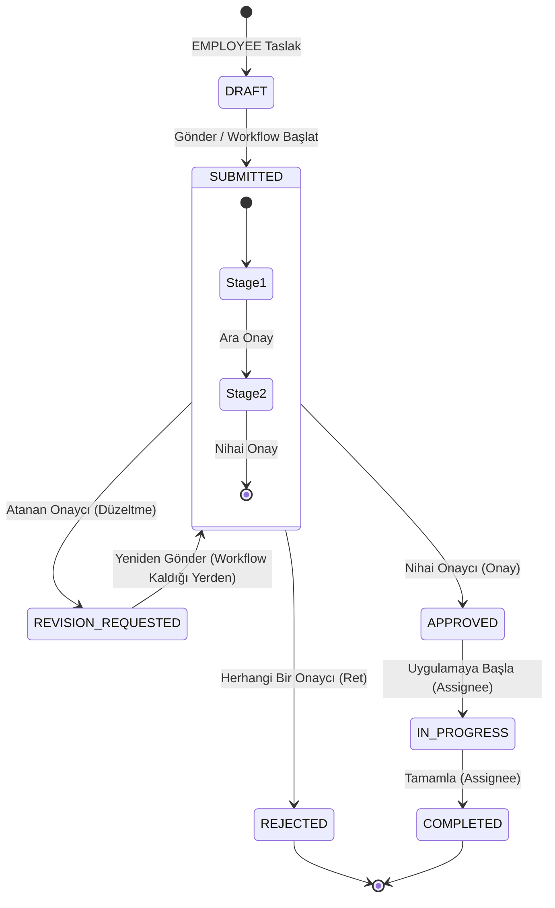

# KaizenFlow – Kaizen İş Akışı ve Durum Geçişleri

* **Belge sürümü:** 2.0 (Gün 11 Sonrası Dinamik Mimari)
* **Staj günü:** Gün 12
* **Çalışma tarihi:** 20.08.2026
* **Durum:** Dinamik iş akışı (Approval Workflow) sonrası revize
* **İlgili Epic:** #3, #5

## 1. Belgenin Amacı
Bu belge, KaizenFlow sistemindeki platform seviyesi yaşam döngüsü durumlarını (Lifecycle State) ve dinamik onay geçiş kurallarını, yetkilendirmeleri ve uygulamanın yürütülmesine dair yolları tanımlar.

## 2. İş Akışı İlkeleri
* **Lifecycle ve Approval Ayrımı:** Platform seviyesi durumlar (DRAFT, SUBMITTED, APPROVED vb.) ile kurumsal onay aşamaları (OPEX_REVIEW, MANAGER_REVIEW vb.) birbirinden ayrılmıştır. Onay aşamaları veritabanında dinamik (ApprovalWorkflow) olarak tutulur.
* **Merkezi transition service kullanımı:** Tüm geçiş işlemleri `KaizenWorkflowTransition` tablosunda immutable loglanarak backend servisleri (StartKaizenWorkflow vb.) üzerinden yürütülür.
* **Backend policy ve sahiplik kontrolü:** Yetkilendirme kararları rol ve Kaizen sahipliği / reviewer ataması kontrolleriyle uygulanır.
* **Her geçişin transaction içinde yürütülmesi:** Durum değişikliği ve log yazımı aynı transaction'da tamamlanır.
* **Historical Reviewer Yetkisi:** Geçmişte işlem yapmış bir incelemeci (reviewer), ilgili Kaizen üzerinde sadece read-only görünürlük hakkına sahiptir; mutation (edit/approve) yapamaz.

## 3. Roller ve İş Akışı Sorumlulukları
| Rol | Sorumlulukları | Yasaklı İşlemler |
| :--- | :--- | :--- |
| **EMPLOYEE** | Kendi Kaizen taslaklarını oluşturmak ve onaya göndermek. | Başkasına ait kayıtları göremez, onaylayamaz. |
| **OPEX_SPECIALIST** | İyileştirme faaliyetlerine rehberlik yapmak ve spesifik iş akışlarında onaycı atanmışsa değerlendirmek. | Sistemin tüm onaylarını tek başına veremez (Eğer config'de tek değilse). |
| **MANAGER** | Kendisine atanan iş akışı adımlarında onay/ret kararını vermek. | Kapsamı dışındaki kayıtları onaylayamaz. |
| **ADMIN** | Sistem referans verilerini ve dinamik iş akışlarını yapılandırmak. | Bir Kaizen önerisini operasyonel olarak onaylayamaz. |

## 4. Platform Durum (Lifecycle State) Sözlüğü
| Durum | Türkçe Karşılığı | Açıklama | Kaydı Düzenleyebilen Rol | İzin Verilen Sonraki Durumlar | Terminal Durum Mu |
| :--- | :--- | :--- | :--- | :--- | :--- |
| **DRAFT** | Taslak | Çalışanın öneri girmeye başladığı kayıt. | EMPLOYEE | SUBMITTED | Hayır |
| **SUBMITTED** | Gönderildi | Onay iş akışının (Workflow) başlatıldığı, ara aşamalarda onaycı dolaşan kayıt. | (Düzenlenemez) | REVISION_REQUESTED, APPROVED, REJECTED | Hayır |
| **REVISION_REQUESTED** | Revizyon Bekleniyor | Mevcut onaycının düzeltme istediği kayıt. | EMPLOYEE | SUBMITTED | Hayır |
| **APPROVED** | Onaylandı | İş akışındaki nihai onaycının onayladığı, uygulama bekleyen öneri. | (Düzenlenemez) | IN_PROGRESS | Hayır |
| **IN_PROGRESS** | Uygulamada | Uygulama sorumlusu tarafından işlemlere başlanmış öneri. | Uygulama Sorumlusu | COMPLETED | Hayır |
| **COMPLETED** | Tamamlandı | Sonuç değerleri girilerek başarıyla kapatılmış öneri. | (Düzenlenemez) | - | **Evet** |
| **REJECTED** | Reddedildi | Herhangi bir aşamada uygun bulunmayarak reddedilmiş öneri. | (Düzenlenemez) | - | **Evet** |

*(Not: Eski `MANAGER_REVIEW` gibi statüler kaldırılmıştır; bu durumlar `ApprovalStage` alanında yer almaktadır.)*

## 5. Ana Süreç Diyagramı

## 6. Dinamik Onay Akışı (SUBMITTED Aşaması)
Gönderilmiş (SUBMITTED) bir Kaizen, veritabanında tanımlı güncel `ApprovalWorkflow` versiyonuna bağlanır (Instance oluşturulur).
Her bir `ApprovalStage` adımında, ilgili `ApprovalGroup`'a atanan yetkili onaycılar işlemi değerlendirir:
- **Onayla (Approve):** İlgili stage tamamlanır (Eğer `is_final` ise Kaizen statüsü `APPROVED` olur).
- **Reddet (Reject):** Kaizen statüsü anında `REJECTED` (terminal) olur. İş akışı sonlanır.
- **Revizyon İste (Revision Request):** Kaizen statüsü `REVISION_REQUESTED` olur. Mevcut `stage` korunur. Çalışan düzelttikten sonra statü `SUBMITTED` olur ve aynı stage'deki onaycının değerlendirmesine tekrar düşer.

## 7. Uygulama ve Tamamlama Akışı (Post-Approval Execution)
**Yol:** APPROVED → IN_PROGRESS → COMPLETED

Uygulama sorumlusu (`assigned_user_id`), onaylanmış işi operasyonel olarak yürütür:
* **Başlangıç:** Onaylanan kayıt (`target_date` ve `assigned_user_id` ile donatılmış), sorumlusu tarafından uygulamaya alınır (IN_PROGRESS). Eşzamanlı işlemleri önlemek için işlem Transaction içinde kilitlenerek (`lockForUpdate`) yapılır.
* **Sonuçlandırma:** İşlem tamamlanırken "Sonuç Açıklaması (actual_result)" zorunlu tutulur (İleride `realized_benefit` vb. eklenecektir).
* **Terminal Durum:** COMPLETED yapıldıktan sonra sistem durumu bir daha değiştirilemez.

## 8. Yetki Matrisi

| İşlem | EMPLOYEE | OPEX_SPECIALIST | MANAGER | ADMIN | ASSIGNEE |
| :--- | :--- | :--- | :--- | :--- | :--- |
| Taslak oluşturma | İzinli | Yasak | Yasak | Yasak | N/A |
| Gönderme / Yeniden Gönderme | İzinli | Yasak | Yasak | Yasak | N/A |
| İş akışında onay / ret / revizyon | Atanmışsa | Atanmışsa | Atanmışsa | Yasak | N/A |
| Uygulamayı başlatma / tamamlama | Yasak | İzinli | Kapsama bağlı | Yasak | İzinli |
| Sistem/Workflow tanımlarını yönetme | Yasak | Yasak | Yasak | İzinli | N/A |

## 9. Kayıt Sahipliği ve Görünürlük
* Yalnızca uygun departman veya atama (assignment) eşleşmesi sağlanan Kaizenler ilgili kullanıcılara görünür.
* **Geçmiş (Archive):** Bir Kaizen üzerinde geçmişte işlem yapan onaycı (Historical Reviewer), o Kaizen'i her zaman salt-okunur (read-only) görebilir.

## 10. Audit Kaydı ve Geçmiş (History)
- `kaizen_status_histories`: Ana (Lifecycle) statü değişikliklerini tutar. Atama değişiklikleri vb. durumlar da `metadata` JSON alanına append-only olarak loglanır.
- `kaizen_workflow_transitions`: Dinamik iş akışındaki tüm ara onay (Approve), Ret ve Revizyon isteklerini yorumları/gerekçeleriyle birlikte iz bırakarak saklar.

## 11. Tamamlanma Kriterleri (Gün 12)
- [x] Legacy statüler (MANAGER_REVIEW vb.) kaldırıldı.
- [x] Dinamik iş akışı mantığı belgelendi.
- [x] Sorumlu ataması ve uygulama yürütmesi (Post-Approval Execution) eklendi.
- [x] Yetki matrisi revize edildi.
